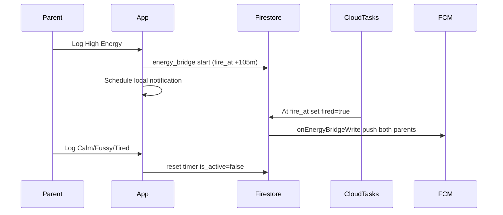

# Sprint 1 — Feature Map & Operations

Sprint 1 delivers Family Meter, Smart Action, Smart Moment, Help flow, Energy Bridge notifications, and child DOB onboarding.

## Screen → Cubit → Repo → Firestore

| Feature | Screen | Cubit | Repo | Firestore |
|---------|--------|-------|------|-----------|
| Family Meter | `home_screen`, `family_meter_*` | `HomeCubit`, `EnergyBridgeCubit` | `ChildRepo`, `EnergyBridgeRepo` | `children/{id}`, `children/{id}/states`, `energy_bridge/{id}` |
| Smart Action | embedded in `home_screen` | `HomeCubit` (state helpers) | — | `children/{id}.child_state` |
| Smart Moment | `smart_moment_screen` | `SmartMomentCubit` | `ChildRepo.saveSmartMomentEvent` | `children/{id}/events` |
| Help flow | `help_*_screen` | `HelpFlowCubit` | `ChildRepo.saveHelpFlowEvent` | `children/{id}/events` |
| Onboarding DOB | `child_profile_screen` | `ChildProfileCubit` | `AuthRepo.addChild` | `children/{id}` |

## Energy Bridge lifecycle

## Co-parent sync

Both parents listen to `children/{defaultChildId}` snapshots via `HomeCubit._listenToChild`. Denormalized `child_state` and `state_updated_at` update within seconds.

## Age calculation

`AgeUtils.resolvedAgeInMonths(dob, legacyAgeText)` — formula `days ~/ 30` from DOB; legacy text fallback for existing users.

## Help content (Part 4)

- Human reference: [LOVINGBRAIN_CONTENT_GUIDE.md](LOVINGBRAIN_CONTENT_GUIDE.md)
- Machine JSON: `assets/content/part4_help_guidance.json`
- Loader: `lib/content/help_guidance_content.dart`
- Sprint 1 maps 4 UI cards; `too_fussy` → crying 0–6mo fallback

## Smart Moment content

Still hardcoded in `SmartMomentCubit` until Sprint content PDF is wired.

## Acceptance tests

See plan `test/sprint_one/` and manual QA checklist in Sprint 1 audit plan.
